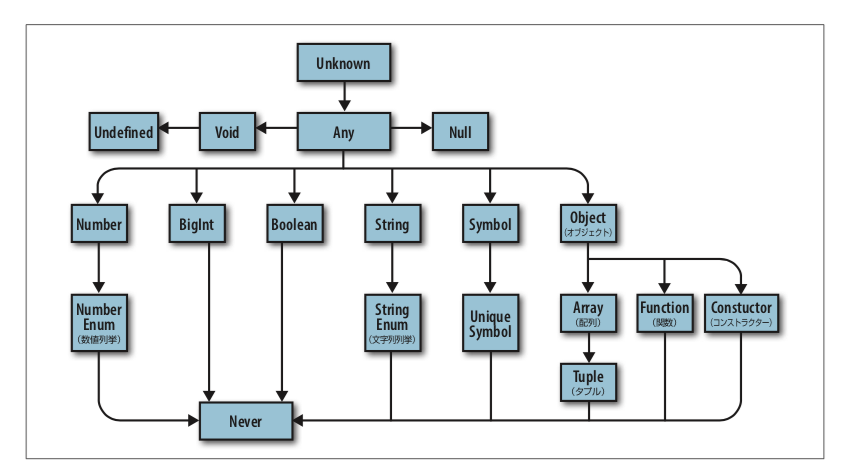

---

title: 【書評】プログラミングTypeScript　〜第3章〜

date: "2020-03-27"

---

O'Reillyから発売されている「プログラミングTypeScript」の書評。

https://www.oreilly.co.jp/books/9784873119045/


## 3章　型について

- 型の階層構造の図がわかりやすい



### any
- tscの設定で、noImplicitAnyをtrueにするのは、最終手段！！(strictがtrueになっていれば問題ない)
- 新規プロジェクトの場合はanyはなるべく使わない方針にする。
- JS→TSへの移行時はanyを許可しないとツライ場面があるかもしれない。


### unknown
- 前もって値が不明な場合に使う。（それでも使わない）
- 使うケースは、typeof演算子や、instanceof演算子などで絞り込みたい場合。

```
let a: unknown = 30
let b = a === 123
let c = a + 10
if (typeof a === 'number') {
  let d = a + 10 // number 
}

```

### boolean

- booleanは、その名の通りtrueかfalseを型チェックする。

```
//普通はこう使う
const A = true

//より厳格にチェックしたい場合は以下
let B: true = true //true
let C: true = false // エラーになる
```

- 1つだけの値を受け入れてそれ以外の値は、受け入れない型は**リテラル型**という。


### number
整数、浮動小数点数、正数、負数、Infinity(無限大)、NaN(非数)など数字に関わることをチェックします。

```
let a = 1234 // number
const b = 5678 // 5678型になる。
let c: number = 100 // number
let d: 26.218 = 10 //エラーになる。

```

上記のように、より厳格にチェックを行うことができる。


### bigInt
JSで表現できる整数より大きな整数を扱うことができる

### string
文字列のチェック。基本的にはnumberと一緒でリテラル型も可能

```
let a = 'Hello' // string
const b = 'Hello!!' // Hello!!
let c: 'test' = 'dev' // エラー

```

### symbol
あまり使わないので省略。

### オブジェクト

型宣言する方法はいくつかある。

```
let a: object = {
  b: 'x' 
}

let a: {b: number} = {
  b: 12
}

```

ただし、すべてはオブジェクトというJavaSctiptの言語特性上、anyとそこまで変わらない。

### インデックスシグネチャ
- オブジェクトは元来、キーとなる値は文字列以外に数値や Symbolなどを指定できる。
- TSでこのいずれかのキーを指定できるという状況を避けるようにするために以下のように```[key: String]: number``` の形式で記述する。

```
// 数値のキーに文字列を保持する連動配列
interface NumStrDictionary {
    [key: number]: string;
}

```

 ### 型エイリアス
- 変数宣言と同じように```type xxx```という形式で型をエイリアス宣言できる
- 変数同様に、スコープを持ちます。

```
type Age = Number //AgeにNumber型を設定した

```

## 配列
推論は以下のような感じ

```
let a = [1, 2, 3]  // number[]
var b = ['a', 'b']  //string[]
let c: string[] = ['a']  //string[]
let d = [1, 'a']  //(number | string)[]
const e = [2, 'b']  // (number | string)[]

```

- 配列は暗黙的に型推論することが多いので使い方によっては、こちらからTS側に情報を与えてあげないといけない


```(number | string)[]```の型だった場合に、例えば全体の配列をマップして小文字→大文字したいケースがあった場合に、数値か文字列を```typeof```でチェックしないといけない。

### タプル
固定長の配列を型付けする特別な方法

```
let a: [string, string, number] = ['malcolm', 'gladwell', 1963]
a = ['queen', 'elizabeth', 'ii', 1926] // エラー TS2322
```

- 上記のように順番通りに型が推論され当てはまらない型が入ってきたらエラーになる。
- 可変長にも対応していてスプレッド演算子で以下のような記述も可能

```
// 少なくとも1つの要素(とそれに続く可変長の要素)を持つ、文字列のリスト
let friends: [string, ...string[]] = ['Sara', 'Tali', 'Chloe', 'Claire']

// 不均一なリスト
let list: [number, boolean, ...string[]] = [1, false, 'a', 'b', 'c']
```

細かい型指定が可能なので積極的に使うことを、推奨されている

### 読み取り専用の配列とタプル
readonlyを使って元の配列の状態をそのままにし。新たにコピーした配列を扱うことができる。

作成する場合は、アノテーションを使用する。

```
let as: readonly number[] = [1, 2, 3] // readonly number[] 
let bs: readonly number[] = as.concat(4) // readonly number[]
let three = bs[2] 
as[4] = 5 //  エラー
```

### null、undefined、void、never
まず使うことはないので省略するが、概要は以下

|  型  |  意味  |
| ---- | ---- |
|  null  |  値の欠如  |
|  undefined  |  値がまだ割り当てられていない変数  |
|  void  |  return文を持たない関数の戻り値  |
|  never  |  決して戻ることのない関数の戻り値  |

## 列挙型(enum)
順序付けされていないデータ構造でキーを値にマッピングする
文字列→数値（数値列挙）、文字列→文字列（文字列列挙）の2種類がある


```
enum Language { 
  English,
  Spanish,
  Russian
}


enum Language {
  English = 100,
  Spanish = 200 + 300,
  Russian // TypeScriptは501と推論します(500の次の数値)
}

```

## TODO
- enum型はこれだけで色々試してブログ化したい。


