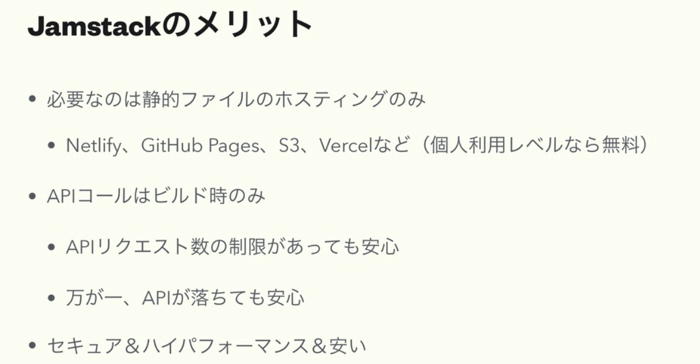
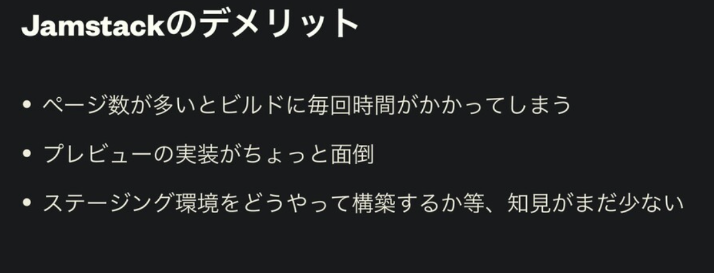

---

title: チャリティカンファレンス沖縄2020 Vol.1 Frontendに参加した

date: "2020-06-21"

---

参加費2,000円で沖縄の返礼品（琉球大学カレーとお菓子）が自宅に届く。コロナの影響で沖縄の観光にも影響が出ており、
何とかしたいという思いで企画されたオンラインのカンファレンス。 

https://charity-conf.okinawa.jp/

[togetter](https://togetter.com/li/1546700)

後で参加者にはアーカイブ動画も公開していただけるとのことだがとりあえず聴いたセッションの感想というかなぐり書きを書いていく

Jamstackの話多め。

### フロントエンド開発における課題を問い直す

https://speakerdeck.com/ug/issues-about-frontend-development

フロントエンドって色々やることあるので、今一度整理してこれからどうやって行くのがよいのかなどの話だった。
まず大前提として「ユーザーに良いUXを提供すること」それを考える材料として「UXハニカム」があることを発表されていた。

良いUXを提供するためには小さくリリースして、フィードバックを受けて改善するサイクルつまり***アジャイル***をするしかないということ、データドリブンで意思決定を行うことが望ましいとのことであった。

これらを解決していく手段として「Firebase」が取り上げられていた。「自分たちで作らないことを増やすこと」これがキーワードで後述するエコシステムのセッションにも通じるところがある。

マルチデバイス対応のアプローチとしてはFlutterが挙げられていた。

SPAで作ることが当たり前になってきた中で、Javascriptの責務が増えバグが多くなりやすくなってきたのでTypeScriptを積極的に使っていくこと。

### あなたの知らないGAS（Google Apps Script）の世界

https://sites.google.com/view/20200621gas/

途中から聴いたけど、GASって色々な使い方があるのがよく分かった。社内ツールとかSlackの通知botとかでしか使ったことないので色々試したい

### SSR/CSR/SSGの動向2020

https://speakerdeck.com/shibe97/ssgfalsedong-xiang-2020

サーバレスSPA、SSG、Jamstackのメリットデメリットのそれぞれ紹介されていた。Jamstackのメリット・デメリットはスライドにもあるがここにもキャプチャして貼っておきたい。

Jamstackはビルド命で、最も大事なこと。ページ生成の時間を以下に削減できるかが鍵

フレームワークのアプローチとして、Nuxt.jsは[payload機能](https://ja.nuxtjs.org/api/configuration-generate/#-code-payload-code-%E3%81%AB%E3%82%88%E3%82%8B%E5%8B%95%E7%9A%84%E3%83%AB%E3%83%BC%E3%83%86%E3%82%A3%E3%83%B3%E3%82%B0%E7%94%9F%E6%88%90%E3%81%AE%E9%AB%98%E9%80%9F%E5%8C%96)があって動的ルーティングが高速化できる。

Next.jsには[Incremental Static Regeneration](https://nextjs.org/blog/next-9-4#incremental-static-regeneration-beta)がある。

Gatsbyにも、Incremental Buildがある。

ヘッドレスCMSの場合下書きプレビューがないので別でSPAで用意する必要がある。Next.jsにはPreview機能がある。まだちゃんと触ったことないので勉強する。

<blockquote class="twitter-tweet">
下書きプレビュー周りよく分かっていない。Next.jsのPreview Mode機能勉強しないと <a href="https://twitter.com/hashtag/charitycon_oki?src=hash&amp;ref_src=twsrc%5Etfw">#charitycon_oki</a> <a href="https://twitter.com/hashtag/roomA?src=hash&amp;ref_src=twsrc%5Etfw">#roomA</a>
&mdash; Ryo Katsuse (@RyoEnter) <a href="https://twitter.com/RyoEnter/status/1274543765055696896?ref_src=twsrc%5Etfw">June 21, 2020</a></blockquote>

### フロントエンドエンジニアのためのFirebaseサーバーレス開発徹底解説

https://speakerdeck.com/takec24/hurontoendoenziniafalsetamefalsefirebasesabaresukai-fa-che-di-jie-shuo

途中子供の世話していたので、端々聴いていた。Firestoreの設計ってやっぱり難しそうという印象。でも出来るようになると色々と出来る幅が増えそう。
DBとかをフロントで管理できるようになりそうだし。

### WordPressサイトをNuxt.js × microCMSのJAMstack構成にリニューアルした話

https://speakerdeck.com/kandai/wordpresssaitowonuxt-dot-js-x-microcmsfalsejamstackgou-cheng-niriniyuarusitahua

クラウドワークスのコーポレートサイトの構成を表題の構成にした話。具体的な事例が聴けて参考になった。

ここでもやっぱりビルド命な話をしていた。Jamstack構成だと時間ぴったりに公開などの概念がないというかできないので、事前に出来ること、出来ないことを
握っておくというか確認しておくが重要だなと思った。microCMS本当に応援してるし頑張ってほしい。私も使い倒せるように頑張る！

<blockquote class="twitter-tweet">
microCMSはサポート対応が神！<a href="https://twitter.com/hashtag/charitycon_oki?src=hash&amp;ref_src=twsrc%5Etfw">#charitycon_oki</a> <a href="https://twitter.com/hashtag/roomB?src=hash&amp;ref_src=twsrc%5Etfw">#roomB</a>
&mdash; Ryo Katsuse (@RyoEnter) <a href="https://twitter.com/RyoEnter/status/1274553896094978048?ref_src=twsrc%5Etfw">June 21, 2020</a></blockquote>

### Next.js Storybook Driven Development

https://www.slideshare.net/takuyatejima1/nextjs-storybook-driven-development

Storybookイイぞおじさんってご本人言ってたw　ここまでしっかりした構成にしているのは凄いと思った。
Storybook導入のハードルって「ちゃんと運用できんの？」尽きるのかなと思っていてこれで結構頭悩ませた時期も個人的に経験しているので
純粋に凄いな。イイなと思った。

storyshots-puppeteerは良さそう。

### フロントエンドのエコシステム

https://speakerdeck.com/10shi10ma/frontend-ecosystem

フロントエンドには、様々なエコシステムがあってそれに乗っかることはいいこと。eslintとかwebpackとかbabelとか。。
本当に様々なプラグインがあり、自分たちで最適化したものを公開できる環境があることは素晴らしいなーと改めて感じた。
サイボウズもeslintのパッケージ公開してる。

https://github.com/cybozu/eslint-config

### AdobeXDで実現するチームにやさしいUIデザイン

https://xd.adobe.com/view/3423914a-8b1a-4ebf-ba9b-99044737db37-6170/

スライドもXD！！！　デザイナーさんの作るスライドは本当に好き。

XDが出た時は結構触っていたけど、今は前職、現職ともにFigma駆動なこともあってXDから離れていたんだけど色々と神機能とかアップデート内容を知れてよかった。

<blockquote class="twitter-tweet">
デザインツールをサクサク動かす姿カッコいいー <a href="https://twitter.com/hashtag/charitycon_oki?src=hash&amp;ref_src=twsrc%5Etfw">#charitycon_oki</a> <a href="https://twitter.com/hashtag/roomA?src=hash&amp;ref_src=twsrc%5Etfw">#roomA</a>
&mdash; Ryo Katsuse (@RyoEnter) <a href="https://twitter.com/RyoEnter/status/1274589776272699392?ref_src=twsrc%5Etfw">June 21, 2020</a></blockquote>

### あなたのWordPressサイトをJAMstackにする話

https://speakerdeck.com/hideokamoto/charity-okinawa-20200621

Jamstack構成の比較対象によく挙げられるWordPressだけどそうではないんだよというお話。

Jamstackの「A」だけWordPressにすることは可能。
全然知らない話で終始頷けながら聴いてしまった。Gatsbyに移行するプラグインなんかもありこれはありかもと思った。特にWordPressは様々な企業で
とりあえず運用している事例はめちゃくちゃあるだろうしフロントだけ刷新したいなどの提案はできそう。

### Tailwind - what is the utility-first CSS framework

最近何かと流行りというか、目にするTailwindCSS。自分も最近個人の趣味で使っているが確かに使いやすくていい。
Bootstrapとの比較もなるほどと思った。最後の質問時間が良かった。

<blockquote class="twitter-tweet">
tailwindcssは上級者向け <a href="https://twitter.com/hashtag/charitycon_oki?src=hash&amp;ref_src=twsrc%5Etfw">#charitycon_oki</a> <a href="https://twitter.com/hashtag/roomA?src=hash&amp;ref_src=twsrc%5Etfw">#roomA</a>
&mdash; Ryo Katsuse (@RyoEnter) <a href="https://twitter.com/RyoEnter/status/1274607575598690304?ref_src=twsrc%5Etfw">June 21, 2020</a></blockquote>

<blockquote class="twitter-tweet">
Laravelが流行るとtailwindcssは流行るかもらしい。作った人がLaravelコミュニティメンバーだから <a href="https://twitter.com/hashtag/charitycon_oki?src=hash&amp;ref_src=twsrc%5Etfw">#charitycon_oki</a> <a href="https://twitter.com/hashtag/roomA?src=hash&amp;ref_src=twsrc%5Etfw">#roomA</a>
&mdash; Ryo Katsuse (@RyoEnter) <a href="https://twitter.com/RyoEnter/status/1274608237166264321?ref_src=twsrc%5Etfw">June 21, 2020</a></blockquote>

## 全体の感想
リアルでのカンファレンスってPC持ち歩いて重いし、場所移動とかして結構疲れるしみたいなのがあるが、
オンラインの長時間カンファレンスは、家でダラダラしながら聴けるし体験としては非常に良かった。

