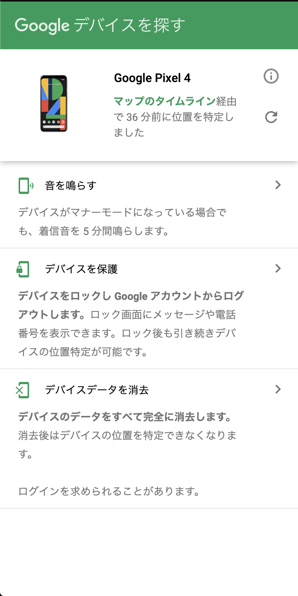

---

title: バスの中でスマホを落としたけど1時間半で回収できた。

date: "2020-08-16"

---

## 事件発覚
息子とバスに乗って帰り、最寄りのスーパーで買い物リストをスマホで確認しようとしたらスマホがないことに気づく。

## 予測
おそらくバスに降りる時に、息子を抱き上げた時にポケットから落ちたと予測した。（それ以外なさそう）

## バス案内所へ
幸い最寄りの駅にバスの案内所があったので事情を説明したところ
> バスは何度も同じルートを行き来していて営業所に戻るまでには、何時間かかかるし（最悪終電まで帰らない）運行中は運転手と連絡などもできないので落とし物は、営業所に戻ってから確認になる。

なるほどと思いながら同時に営業所の電話番号が、書かれた紙を受け取りとりあえず家に帰ることにした。

## 帰宅後にすぐやったこと

自分のスマホはPixel4を使用している。とりあえず[GPSを使ってスマホ](https://support.google.com/pixelphone/answer/9338680?hl=ja)を探すことにした。

以下の条件が揃っているとスマホの現在地が分かるとのこと。
- 電源がオンになっている
- Google アカウントにログインしている
- モバイルデータまたは Wi-Fi に接続している
- Google Play での表示がオンになっている
- 位置情報がオンになっている
- 「デバイスを探す」がオンになっている

自分のスマホは幸いにも全て有効になっていたので、以下にアクセスしてみる。

https://www.google.com/android/find

以下画像のような左のメニューと右側にマップが表示されたUIが表示される。

とりあえず「デバイスを保護」をしてロック画面に簡易メッセージと、良心のある方が拾った時に連絡してくれる用に妻の携帯番号を表示させておく。

設定した後にマップにスマホの現在地が表示された！表示された位置は、丁度バスの終着駅になっていたのでこれでスマホは、バスの中に置き忘れたことがほぼ確。

この時点で、営業所に電話してみる。スマホをバスに忘れたこと、現在GPSで位置確認はできていると伝える。すると今終着駅にいるバスが、自分が降りた停留所に到着する予定時刻を教えてくれた。

> お近くの停留所で待って運転手に忘れ物の確認をしてみてください。

とのこと。

30分ぐらいで到着予定だったのでそれまでGPSを見張っていると、バスのルートと同じようにスマホも移動していることが確認できた。

教えてくれた時間に停留所に行く。GPSは確認したいので妻のスマホを借りた。

バスが停留所に着いた。

> 自分：「すみません。スマホをこのバスに忘れたかもしれないので探してもいいですか。GPSで確認はできています。」

> 運転手：「色を教えてもらっていいですか？」

> 自分：「黒です。」

> 運転手：「ほらよ！　これでしょ？」

> 自分：「！！！？」

という感じのやり取りでPixel4を渡してくれた。乗客の方がスマホを拾って運転手に渡してくれたとのこと。

スマホを無くしたと気づいてから大体1時間半ほどで回収できた。。良かった。。

## 振り返り
今回は、色々と状況が良かった。

- GPS機能が使えた。
- 帰りのバスだった。（行きのバスだと妻のスマホがなかったり、PCもないので連絡手段がない）
- 乗客の方に拾っていただき、運転手に渡していた。
- 自分が帰りに落とした時と同じ運転手がそのままバスを運転していた。

上記の条件1つでも欠けていたら今も回収できていないかもしれないと思うと幸運だった。

## GPS
更新ボタンを押しても更新されない時が結構あったけど基本的には性能は良かった。

今回はバスということもあり、移動して止まっての繰り返しが多いのも幸運だったと思う。これが電車だと移動速度も速いのでGPSが中々安定しないでいきなり凄い場所に移動しちゃっていることもあると思う。

## まとめ
- 今回自分が忘れたバスは「西武バス」なので他のバスでは、対応が違うかもしれない。
- GPSの有効は常にしておくことが大事だなと思った。行く場所がバレるの嫌だ！とかもあるかもしれないけれど。。
- 子供を抱っこする時は要注意！

