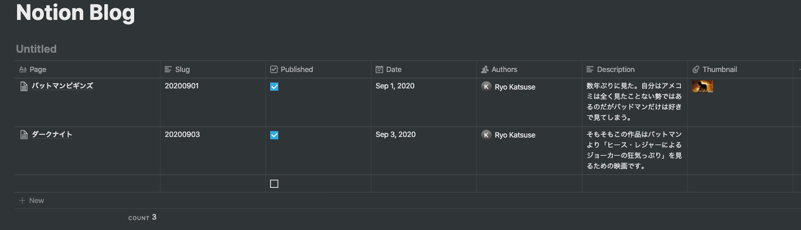

---

title: Notion-Blogでブログ作った

date: "2020-09-08"

---

[キネマトグラフ](https://kinematograph.vercel.app/)というブログを開設した。

リポジトリはこちら
https://github.com/ryokatsuse/Notion-Blog

### 使っている技術

- [Notion-blog](https://github.com/ijjk/notion-blog)
- Next.js
- Vercel

Notion-blogは、Next.jsで作られているNotion非公式のアプリケーションで、SSGになるので静的なサイトとして公開される。

特長としてNotionのpageそのものがCMSになってくれるというスグレモノ。

### 導入方法

[こちらの記事](https://blog.35d.jp/2020-05-23-notion-blog-1)を参考にすればよい。とても分かりやすい。

### 実際の記事投稿

ページを作成してデプロイが完了するとページの雛形（テーブル）が自動的に作成される。デフォルトでは

- Page: 記事タイトル
- Slug: ブログ記事 URL
- Published: 公開フラグ（チェックすると公開される）
- Date: 記事を書いた日
- Authors: 記事を書いた人

になっているがここはカスタマイズ可能となっている。テーブル一つ一つの項目がAPIのレスポンスとなっているので、画面側に表示する時も非常に扱いやすい。

デフォルトだと日付がUS時間になっているので[このコミット](https://github.com/ryokatsuse/Notion-Blog/commit/b22d6f47098854c0be55ebb9637c0563b7f4f182)のように修正すると良い。

また、日付のソートも古いものが上部になる仕様になっているので[こんな感じ](https://github.com/ryokatsuse/Notion-Blog/commit/4e2465893e90772dbae2238f662dad2c2ff8bead)で修正するといいかも。

## TODO
- OGPの設定
- GAの導入
- 検索機能をつけたい

