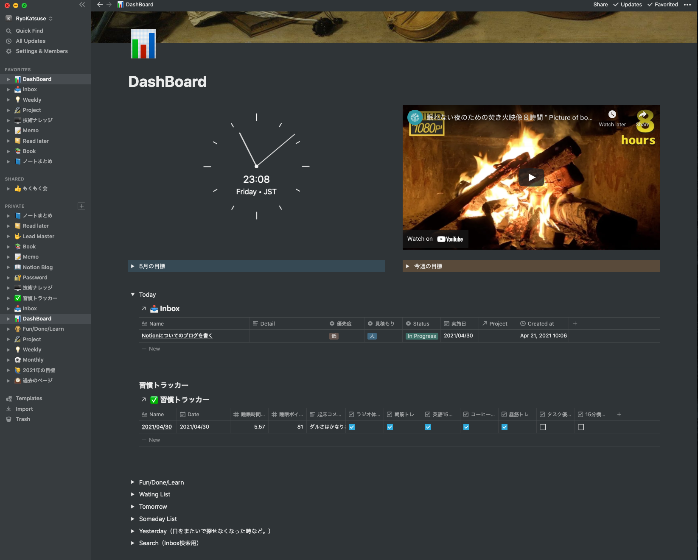
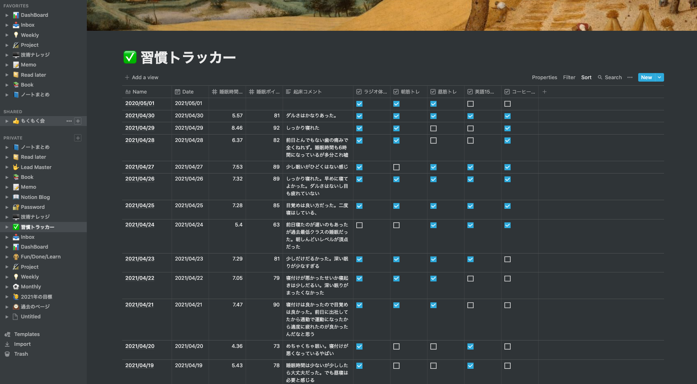
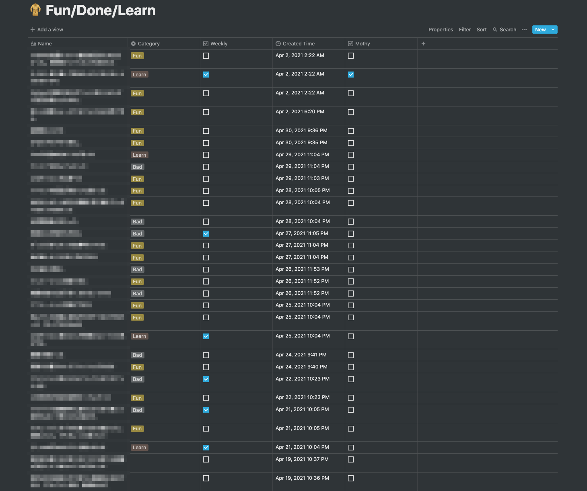
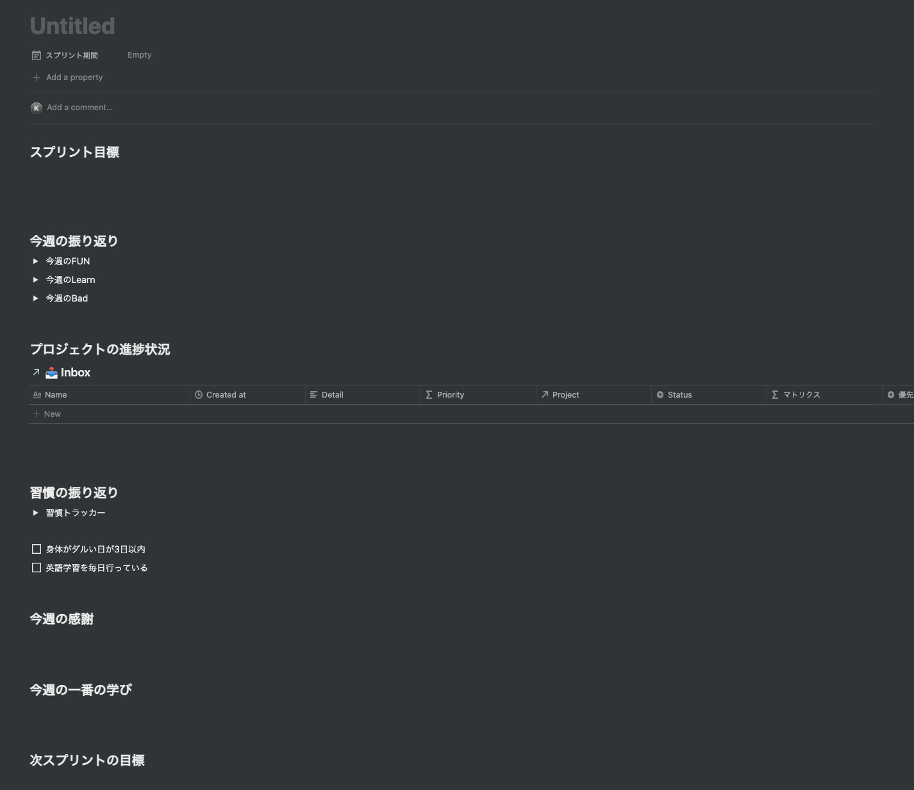
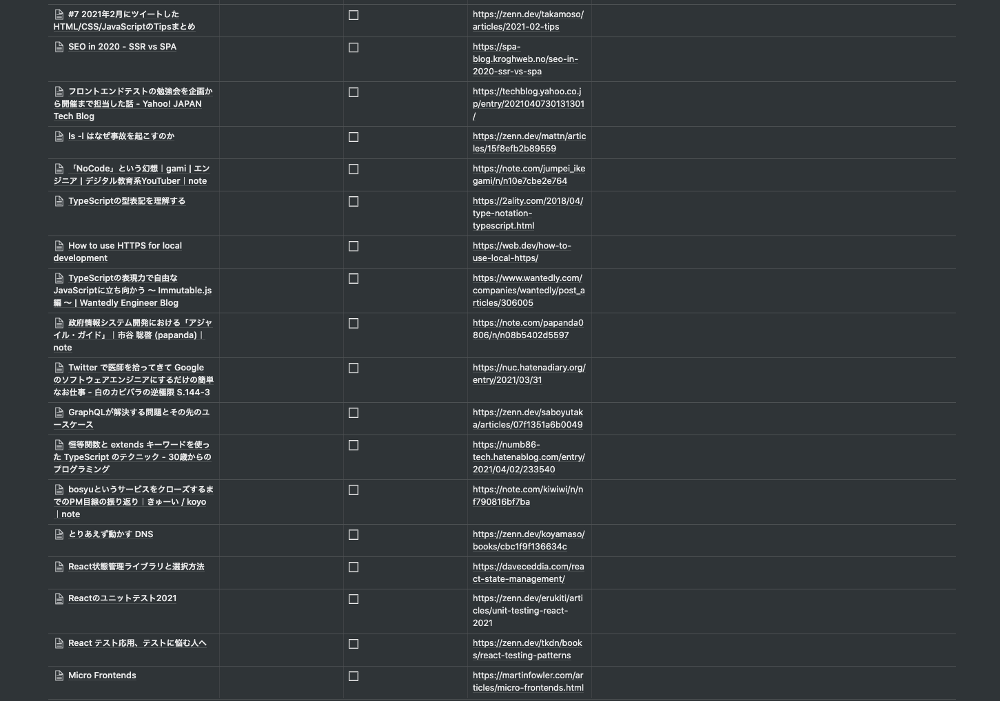
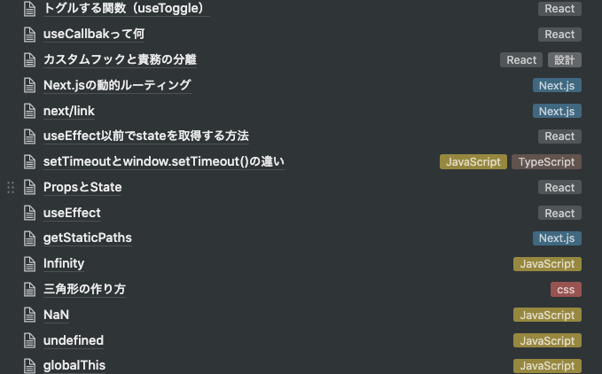

---

title: 自分なりのNotionの使い方をまとめる
date: "2021-05-01"
tags: ['Notion', '雑記']
---

2年ぐらい使っているツールですが、最近ようやく管理方法が落ち着いてきたのでまとめようと思います。
とは言えほぼほぼ以下のスライドの内容を参考に作りました。

[Atomic Scrum 個人の生産性を最大化する方法](https://speakerdeck.com/raykataoka/atomic-scrum-ge-ren-falsesheng-chan-xing-wozui-da-hua-surufang-fa)

これを見た時に「求めていたのはこれだ！」と思いました。近い運用をしていたのですが、データベースの使い方が匠だなと思ったので、そこを真似した形で運用を始めた所自分でも納得のいく感じになりました。

### ダッシュボード

（焚き火の動画は心が落ち着くのでよく作業BGMとして流しています。。）

基本的にこのページを常に表示させています。中身の項目を常に表示させておくと情報量が多いので基本的には「今週の目標」と「Today」のトグルだけ表示させています。
上部に出ている時計ウィジェットは[Indify](https://indify.co/)というサービスを使うことで利用できます。

※ただし、このウィジェットを使う時にアニメーション設定などを行うとCPUを使ってファンが回り出すので可能性があるので注意！（M1Macとかだと大丈夫かも）

ダッシュボードにある各種情報のほとんどが「Create Linked Database」の機能を使って各種のデータベースを呼び出しています。データベースを呼び出した後はフィルター機能を使っています。例えば「Tomorrow」のトグルの中には明日着手予定のタスク一覧だけ表示されています。

### Inbox

GTDのワークフローで日々のタスクを運用しているためInboxに仕事、プライベート関係なくひたすら入力していきます。1日の終わりにInboxを見直す時間を取っていて、GTDのワークフローに沿って整理していきます。

※GTDについては、[全面改訂版 はじめてのGTD ストレスフリーの整理術](https://www.amazon.co.jp/%E5%85%A8%E9%9D%A2%E6%94%B9%E8%A8%82%E7%89%88-%E3%81%AF%E3%81%98%E3%82%81%E3%81%A6%E3%81%AEGTD-%E3%82%B9%E3%83%88%E3%83%AC%E3%82%B9%E3%83%95%E3%83%AA%E3%83%BC%E3%81%AE%E6%95%B4%E7%90%86%E8%A1%93-%E3%83%87%E3%83%93%E3%83%83%E3%83%89%E3%83%BB%E3%82%A2%E3%83%AC%E3%83%B3/dp/4576151878)という本がおすすめなので是非読んでください。

InboxページもPCで作業している際は、常に開いた状態にしていますが、外出時は近くにPCがない場合もありInboxに入れようと思ってもその場で入れることが難しい状況があります。GTDにおいてInboxへのタスクの追加のしやすさは一番重要で、ここで追加しにくいユーザー体験になってしまうと途端にGTDのワークフローが破綻してしまいます。（Notionのスマホアプリは起動が重く割とストレスです。。。）

自分は、[Fast Notion](https://www.notion.so/Fast-Notion-74dd4501d5824de7997a143baba1098f)というアプリを使用していてます。これが神アプリで起動してすぐ入力するUIが出てきてそのままPOSTすると、指定したNotionのページにデータが反映されるスグレモノです！「あれやんなきゃ」と思ってもその場で、入力するまでの時間に「何だっけ」と忘れることがあったりするのですが、このアプリのおかげで忘れず入力することができています。

Inboxに入力する際に、タスクの粒度は適当です。明確にやらなくてはいけないタスクべースのものから、いくつかに小分けしないと消化できないタスクまで様々あり、寝る前にInboxを必ず確認してなるべくInboxを空の状態にしています。

### 習慣トラッカー
マスターは以下のようになっています。

この運用にするまではダッシュボードの上部に習慣化したい事柄のチェックボックスをおいて毎日チェックする→翌日チェックを外すという運用していたのですが、一週間でどれぐらいやったか可視化したくてこの形にしました。

毎日ダッシュボードに、今日の日付のデータを作成して運用しているので、マスターを見ることはほぼありません。Weeklyの振り返り時に使うテンプレートにも1週間の間でソートして表示するようにしています。

習慣化自体は1ヶ月周期で結構頻繁に変えています。これは自分が単純に飽き性だからです。。

### Fun/Done/Learn
毎日仕事が終わった時や寝る前に、「良かったこと」「学んだこと」「失敗したこと」を記述します。
一週間の振り返り時に深堀りしたいことなどがあれば「Weekly」にチェックをしておきます。1ヶ月に振り返り時に更に深堀りたいなどがあれば1週間の振り返り時に「Mothy」にチェックを入れておきます。

### Weekly/Mothy

毎週日曜日と、月末に振り返りをしています。（25分）以下のようなテンプレートを用意していて1週間でフィルターしてあるデータベースを確認しながらどんな感じだったかを振り返ります。

### Read later

「Notion Web Clipper」かAndroidの共有機能を使って後で読む記事を全部溜め込みます。時間が空いた時と1週間の中で2時間程度記事を消化する時間を設けているのでその時間を使って消化していきます。読んだものをチェックをしてTagにカテゴリをつけておきます。気に入った記事にも別でチェックをつけておきます。

### 技術ナレッジ

何か技術的に学びがあった時や自分の言葉で説明したいことなどを溜めておくページです。昔はここにコードスニペットなども入れていたのですが、運用が面倒なこと。Googleで検索して近いコードを探すのと、Notion上で検索して探すコストがそこまで変わらないので、途中から管理するのを辞めました。本当によく使うソースコードなどはVS Code上にスニペット機能があるのでそちらを使ったりしています。

### メモ/Books/ノートまとめ

このあたり表題どおりで簡易メモと読んだ本のメモと何かアイデアとかをまとめたい時のノート置き場になっています。

### ポモドーロ

自分はポモドーロで作業することがほとんどです。なので、Inboxのタスクも25分を基本としてタスクの重みをつけています。例えば1日掛かりそうな実装があったとして、プルリク単位でタスク化するのではなくコミットごと、1機能ごとに25分ベースでタスク化しています。ただ見積もりなんてブレるのが当たり前なので、そこまで厳密にしていません。ざっくりタスク化している部分もあります。

### まとめ

Notionは最初こそ取っ付きにくいですが、自分の好きなようにカスタマイズできるので、自分の欲しい管理ツールを手に入れることができます。キーボードを自作するのと一緒だと思います。この記事では自分が普段どんな感じで使っているの簡単に紹介しましたが、GTDとの相性がかなりいいのでGTDのフローで普段仕事されている方はおすすめします。

