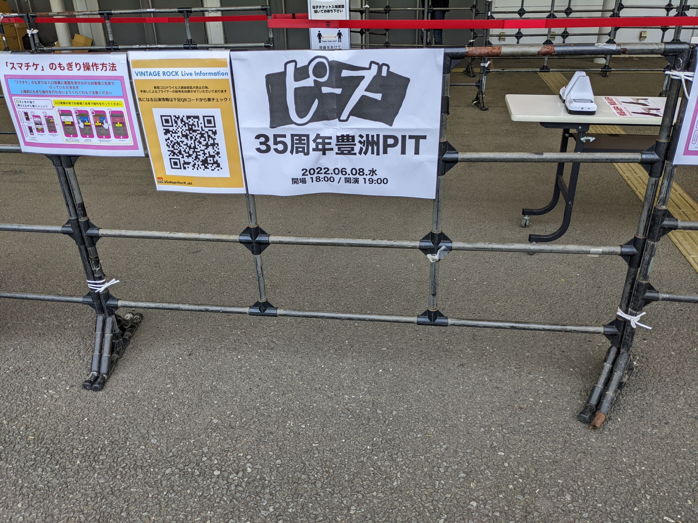

---

title: ピーズ35周年Live行ってきた
date: "2022-06-09"
updated: ""
tags: ['雑記']
---

行ってきました。ライブ自体も2,3年ぶりだと思います。

### 久しぶりのライブハウス

豊洲PITに行ってきました。新橋から歩いて1時間ほどだったので、散歩がてら歩いて行きました。

<blockquote class="twitter-tweet">
SL工事中だった。。 <a href="https://t.co/mhHwj2gAUh">pic.twitter.com/mhHwj2gAUh</a>
&mdash; Ryo Katsuse (@ryo__kts) <a href="https://twitter.com/ryo__kts/status/1534434956864196608?ref_src=twsrc%5Etfw">June 8, 2022</a></blockquote>

コロナ以降ライブハウスは行ってなかったので、全部がそうではないと思いますが今回は指定席でした。実際はライブハウスに番号付きの椅子が敷き詰められておりそこでライブを見る感じでした。以前までは荷物があればコインロッカーに閉まっていたりしましたが、椅子があるので椅子の上にも下にも荷物置けるのし、以前は一度トイレに行って帰ってくると、その場所に誰か違う人が立っているみたいなことがあったのですが、席が決められているのでそんなこともなく体験が良かったです。

中に入ると中規模ぐらいかなと思っていたのですが、そんなことはなくZepp Tokyoよりも多かった。。

### ピーズと私

最初は、高校の同級生にピーズの熱狂的なファンがいて当時は、「ふーん。そんなバンドもいるんだ」ぐらいな感じでしたが、大学に入って様々なアーティストがピーズをリスペクトしている情報を耳にして聴いてみることに。最初に「The ピーズ」というバンド名そのままのアルバムの1曲目「行きのばし」の出だしを聴いてファンになったのを今でも覚えています。そこからと言うもの何度かライブに足を運ぶようになりました。

### 5年ぶりのピーズ

30周年記念武道館ライブ以来でした。いい意味でハルさん、アビさんは何も変わっておらず、カッコいい歳の取り方をしていました。40周年手前で還暦になると聴いてちょっとびっくりでしたが、色々休止期間や病気、メンバーの入れ替えも行いながら継続できていることに尊敬します。

5年前と変わったことがいくつかありました。

- 4人体制になった（ベースとドラムが加入した。シンちゃん（ピロウズのドラム）は脱退している）
- ハルさんがベースからギターになっている
- バンド名が「Theピーズ」ではなく「ピーズ」

ベースが加入したのが意外でした。今までベースはハルさんのみだったのに歳なのでちゃんと弾きなくなったとか？もしかしたらインタビュー記事とかライブのMCとかで発言しているかもだけど。。

### どうだった。

一言で言うと最高でした。「35周年なので35曲やります」とハルさんが最初言ってて結果として本当に35曲（多分）やってました。ライブ自体も3時間弱やっていたのでボリュームがありました。もう35周年もなるとライブは慣れたもので、適度にふざけたりしながら演奏している姿が、最高に良かったです。

1曲目のドロ舟でいきなりテンションあがり、その後も比較的新し目の曲から実験4号、脱線、サマー記念日のようなナンバーを交互に演奏しながら前半は終わりました。ハルさんの声量は本当に56際なん？と思うぐらい出ていて凄かった。

後半は盛り上がる曲が多く特に「体にやさしいパンク」「日が暮れて〜」「行きのばし」の流れはちょっと目頭が熱くなりました。

アンコールは怒涛のナンバーが続いて普段盛り上がる「ラブホ」はしっとりエロティックバージョンで演奏していて新鮮な感じもありつつ、赤羽ドリーミンから最後グライダーまでの流れはめちゃくちゃ良かった。。欲を言えば「シニタイヤツハシネ」の長尺バージョンが聴きたかったが、あれは演奏する側は相当体力使うもんな。。。次回に期待です。（トモフスキーも来てくれるといいな。）

40周年、その前に還暦も控えているのでそれまで「せいぜい生きいきのびてくれ」

<iframe style="border-radius:12px" src="https://open.spotify.com/embed/track/0TP9SyIKlvD5pGCJ9LYvl5?utm_source=generator" width="100%" height="380" frameBorder="0" allowfullscreen="" allow="autoplay; clipboard-write; encrypted-media; fullscreen; picture-in-picture"></iframe>

そういえばライブハウスについても色々と語りたいことがあるのでいずれブログに書こう。

